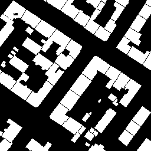

Airtiler
========

|Build Status|

The airtiler generates training / test data for neural networks by
downloading buildings from vector data from OpenStreetMap and the
corresponding satellite images from Microsoft Bing Maps.

It then generates binary masks from the vector data which can be used
for example for instance segmentation.

Examples
--------

+---------------------+----------+----------+
| Instance Separation | Image    | Mask     |
+=====================+==========+==========+
| False               | |image1| | |image2| |
+---------------------+----------+----------+
| True                | |image3| | |image4| |
+---------------------+----------+----------+

Installation
------------

To install airtiler run:

.. code:: python

    pip install airtiler

Usage
-----

::

    airtiler -c sample_config.json

API
~~~

.. code:: python

    airtiler = Airtiler("bing_key")
    airtiler.process(config)

Config
~~~~~~

+---------------+----------+
| Key           | Required |
+===============+==========+
| options       |          |
+---------------+----------+
| boundingboxes | Yes      |
+---------------+----------+

Options (optional)
^^^^^^^^^^^^^^^^^^

+-----------------------------------+-----------------------------------+
| Key                               | Description                       |
+===================================+===================================+
| target_dir                        | The directory where the files     |
|                                   | will be written to                |
+-----------------------------------+-----------------------------------+
| zoom_levels                       | Global zoom levels which will be  |
|                                   | used, if a boundingbox if         |
|                                   | specified in short format or has  |
|                                   | no boundingboxes.                 |
+-----------------------------------+-----------------------------------+
| separate_instances                | If true, each building instance   |
|                                   | will be separated. Otherwise, a   |
|                                   | building consisting from multiple |
|                                   | instances will be rendered as     |
|                                   | one.                              |
+-----------------------------------+-----------------------------------+

Sample config
~~~~~~~~~~~~~

.. code:: json

    {
      "options": {
        "target_dir": "./output/blabla",
        "zoom_levels": [15, 16, 17],
        "separate_instances": false
      },
      "boundingboxes": {
        "firenze": [11.239844, 43.765851, 11.289969, 43.790065],
        "rapperswil": {
          "zoom_levels": [17, 18],
          "tr": 8.818724,
          "tl": 47.222126,
          "br": 8.847435,
          "bl": 47.234629
        },
        "new_york": {
          "tr": -74.02059,
          "tl": 40.646089,
          "br": -73.864722,
          "bl": 40.77413
        }
      }
    }

Projects
--------

The airtiler is used in the following projects:

-  `Deep OSM - Instance segmentation using orthophotos and OSM data`_

.. _Deep OSM - Instance segmentation using orthophotos and OSM data: https://github.com/mnboos/osm-instance-segmentation

.. |Build Status| image:: https://travis-ci.org/mnboos/airtiler.svg?branch=master
   :target: https://travis-ci.org/mnboos/airtiler
.. |image1| image:: images/image2.png
.. |image2| image:: images/mask2.png
.. |image3| image:: images/image1.png
